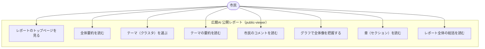

## エンドユーザー（一般市民）の利用ユースケース

技術者向け（内部仕様・データフロー理解が必要な人向け）

技術者向けは、UI操作 → API呼び出し → データ取得 → 表示までの裏側の流れを含めて説明します。
「どの画面で何が起きているか」「どのAPIが叩かれるか」「どのデータが返るか」を理解するためのユースケースです。

---

1. トップページにアクセスする

行動

市民が公開URL（public-viewer）にアクセスする。

バックエンド動作

• GET /reports/{id}
• GET /reports/{id}/summary
• GET /reports/{id}/clusters

表示される内容

• レポートタイトル
• レポート全体の要約（LLM生成）
• セクション（章）一覧
• クラスタ（テーマ）一覧

---

2. 興味のあるテーマ（クラスタ）を選ぶ

行動

「子育て」「防犯」「交通」「公園」などのクラスタをクリック。

バックエンド動作

• GET /reports/{id}/clusters/{cluster_id}
• GET /reports/{id}/comments?cluster_id=xxx

表示される内容

• クラスタ名（LLM生成テーマ）
• クラスタ要約（LLM生成）
• コメント一覧（市民の生の声）
• コメント数・代表コメント

---

3. コメントを読む

行動

クラスタ内のコメントをスクロールして読む。

バックエンド動作

• 追加API呼び出しなし（初回取得済み）
• フロント側でフィルタリング・ソート（hooks）

表示される内容

• コメント本文
• 代表コメント（クラスタの中心的意見）
• コメントの長さ・投稿順などのメタ情報

---

4. グラフ（散布図）で全体像を把握する

行動

「意見の分布を見る」などのボタンを押す。

バックエンド動作

• GET /reports/{id}/embedding（次元削減済み座標）
※embedding はバックエンドで生成済み

表示される内容

• 散布図（Recharts）
• 各点＝コメント
• 色＝クラスタ
• ホバーでコメント内容を表示

---

5. セクション（章）を読む

行動

「安全」「子育て」「インフラ」などの章を開く。

バックエンド動作

• GET /reports/{id}/sections
• GET /reports/{id}/sections/{section_id}

表示される内容

• セクション要約
• セクション内のクラスタ一覧
• 関連コメント

---

6. レポート全体を俯瞰する

行動

トップに戻って全体要約を読む。

バックエンド動作

• GET /reports/{id}/summary

表示される内容

• LLM が生成した総括
• 市民の意見の傾向
• 主要テーマのまとめ

---

## エンドユーザー（一般市民）の利用ユースケース

非技術者（運営ボード向け：わかりやすさ重視）

こちらは、技術的な説明を排除し、利用価値・行動・得られる気づきにフォーカスしたユースケースです。
自治体のボードメンバーや意思決定者向け。

---

1. レポートのトップページを見る

市民はまず、レポートの「全体要約」を読みます。
ここには、自由記述の意見をAIが整理した「市民の声の全体像」が書かれています。

---

2. 興味のあるテーマを選ぶ

「子育て」「防犯」「交通」「公園」など、関心のあるテーマをクリックすると、
そのテーマに関する市民の声がまとまって表示されます。

---

3. 市民の生の声を読む

テーマの中には、実際に寄せられたコメントが一覧で表示されます。
市民は他の市民の声を知ることができ、自治体は「どんな声が多いか」を把握できます。

---

4. グラフで全体像を理解する

散布図や棒グラフで、

• どのテーマが多いか
• どの意見が中心的か
• 市民の意見がどう分布しているか
が視覚的にわかります。

---

5. 章（セクション）ごとに深掘りする

レポートは章立てになっており、
「安全」「子育て」「インフラ」などの大きなテーマごとにまとめられています。

---

6. レポート全体を俯瞰する

最後に、AI が生成した「総括」を読むことで、市民の声の全体的な傾向や課題が一目でわかります。

エンドユーザー（一般市民）が広聴AIをどう利用するかを、技術者向けと**非技術者（運営ボード向け）**の2種類で、それぞれ目的に合わせて構造化してまとめます。
両者は同じ利用行動を扱いますが、視点・粒度・説明の深さを変えています。

---

🧭 エンドユーザー（一般市民）の利用ユースケース

技術者向け（内部仕様・データフロー理解が必要な人向け）

技術者向けは、UI操作 → API呼び出し → データ取得 → 表示までの裏側の流れを含めて説明します。
「どの画面で何が起きているか」「どのAPIが叩かれるか」「どのデータが返るか」を理解するためのユースケースです。

---

1. トップページにアクセスする

行動

市民が公開URL（public-viewer）にアクセスする。

バックエンド動作

• GET /reports/{id}
• GET /reports/{id}/summary
• GET /reports/{id}/clusters

表示される内容

• レポートタイトル
• レポート全体の要約（LLM生成）
• セクション（章）一覧
• クラスタ（テーマ）一覧

---

2. 興味のあるテーマ（クラスタ）を選ぶ

行動

「子育て」「防犯」「交通」「公園」などのクラスタをクリック。

バックエンド動作

• GET /reports/{id}/clusters/{cluster_id}
• GET /reports/{id}/comments?cluster_id=xxx

表示される内容

• クラスタ名（LLM生成テーマ）
• クラスタ要約（LLM生成）
• コメント一覧（市民の生の声）
• コメント数・代表コメント

---

3. コメントを読む

行動

クラスタ内のコメントをスクロールして読む。

バックエンド動作

• 追加API呼び出しなし（初回取得済み）
• フロント側でフィルタリング・ソート（hooks）

表示される内容

• コメント本文
• 代表コメント（クラスタの中心的意見）
• コメントの長さ・投稿順などのメタ情報

---

4. グラフ（散布図）で全体像を把握する

行動

「意見の分布を見る」などのボタンを押す。

バックエンド動作

• GET /reports/{id}/embedding（次元削減済み座標）
※embedding はバックエンドで生成済み

表示される内容

• 散布図（Recharts）
• 各点＝コメント
• 色＝クラスタ
• ホバーでコメント内容を表示

---

5. セクション（章）を読む

行動

「安全」「子育て」「インフラ」などの章を開く。

バックエンド動作

• GET /reports/{id}/sections
• GET /reports/{id}/sections/{section_id}

表示される内容

• セクション要約
• セクション内のクラスタ一覧
• 関連コメント

---

6. レポート全体を俯瞰する

行動

トップに戻って全体要約を読む。

バックエンド動作

• GET /reports/{id}/summary

表示される内容

• LLM が生成した総括
• 市民の意見の傾向
• 主要テーマのまとめ

---

🧭 エンドユーザー（一般市民）の利用ユースケース

非技術者（運営ボード向け：わかりやすさ重視）

こちらは、技術的な説明を排除し、利用価値・行動・得られる気づきにフォーカスしたユースケースです。
自治体のボードメンバーや意思決定者向け。

---

1. レポートのトップページを見る

市民はまず、レポートの「全体要約」を読みます。
ここには、自由記述の意見をAIが整理した「市民の声の全体像」が書かれています。

---

2. 興味のあるテーマを選ぶ

「子育て」「防犯」「交通」「公園」など、関心のあるテーマをクリックすると、
そのテーマに関する市民の声がまとまって表示されます。

---

3. 市民の生の声を読む

テーマの中には、実際に寄せられたコメントが一覧で表示されます。
市民は他の市民の声を知ることができ、自治体は「どんな声が多いか」を把握できます。

---

4. グラフで全体像を理解する

散布図や棒グラフで、

• どのテーマが多いか
• どの意見が中心的か
• 市民の意見がどう分布しているか
が視覚的にわかります。

---

5. 章（セクション）ごとに深掘りする

レポートは章立てになっており、
「安全」「子育て」「インフラ」などの大きなテーマごとにまとめられています。

---

6. レポート全体を俯瞰する

最後に、AI が生成した「総括」を読むことで、
市民の声の全体的な傾向や課題が一目でわかります。

---

エンドユーザー（一般市民）が広聴AIをどう利用するかを、技術者向けと**非技術者（運営ボード向け）**の2種類で、それぞれ目的に合わせて構造化してまとめます。
両者は同じ利用行動を扱いますが、視点・粒度・説明の深さを変えています。

---

🧭 エンドユーザー（一般市民）の利用ユースケース

技術者向け（内部仕様・データフロー理解が必要な人向け）

技術者向けは、UI操作 → API呼び出し → データ取得 → 表示までの裏側の流れを含めて説明します。
「どの画面で何が起きているか」「どのAPIが叩かれるか」「どのデータが返るか」を理解するためのユースケースです。

---

1. トップページにアクセスする

行動

市民が公開URL（public-viewer）にアクセスする。

バックエンド動作

• GET /reports/{id}
• GET /reports/{id}/summary
• GET /reports/{id}/clusters

表示される内容

• レポートタイトル
• レポート全体の要約（LLM生成）
• セクション（章）一覧
• クラスタ（テーマ）一覧

---

2. 興味のあるテーマ（クラスタ）を選ぶ

行動

「子育て」「防犯」「交通」「公園」などのクラスタをクリック。

バックエンド動作

• GET /reports/{id}/clusters/{cluster_id}
• GET /reports/{id}/comments?cluster_id=xxx

表示される内容

• クラスタ名（LLM生成テーマ）
• クラスタ要約（LLM生成）
• コメント一覧（市民の生の声）
• コメント数・代表コメント

---

3. コメントを読む

行動

クラスタ内のコメントをスクロールして読む。

バックエンド動作

• 追加API呼び出しなし（初回取得済み）
• フロント側でフィルタリング・ソート（hooks）

表示される内容

• コメント本文
• 代表コメント（クラスタの中心的意見）
• コメントの長さ・投稿順などのメタ情報

---

4. グラフ（散布図）で全体像を把握する

行動

「意見の分布を見る」などのボタンを押す。

バックエンド動作

• GET /reports/{id}/embedding（次元削減済み座標）
※embedding はバックエンドで生成済み

表示される内容

• 散布図（Recharts）
• 各点＝コメント
• 色＝クラスタ
• ホバーでコメント内容を表示

---

5. セクション（章）を読む

行動

「安全」「子育て」「インフラ」などの章を開く。

バックエンド動作

• GET /reports/{id}/sections
• GET /reports/{id}/sections/{section_id}

表示される内容

• セクション要約
• セクション内のクラスタ一覧
• 関連コメント

---

6. レポート全体を俯瞰する

行動

トップに戻って全体要約を読む。

バックエンド動作

• GET /reports/{id}/summary

表示される内容

• LLM が生成した総括
• 市民の意見の傾向
• 主要テーマのまとめ

---

🧭 エンドユーザー（一般市民）の利用ユースケース

非技術者（運営ボード向け：わかりやすさ重視）

こちらは、技術的な説明を排除し、利用価値・行動・得られる気づきにフォーカスしたユースケースです。
自治体のボードメンバーや意思決定者向け。

---

1. レポートのトップページを見る

市民はまず、レポートの「全体要約」を読みます。
ここには、自由記述の意見をAIが整理した「市民の声の全体像」が書かれています。

---

2. 興味のあるテーマを選ぶ

「子育て」「防犯」「交通」「公園」など、関心のあるテーマをクリックすると、
そのテーマに関する市民の声がまとまって表示されます。

---

3. 市民の生の声を読む

テーマの中には、実際に寄せられたコメントが一覧で表示されます。
市民は他の市民の声を知ることができ、自治体は「どんな声が多いか」を把握できます。

---

4. グラフで全体像を理解する

散布図や棒グラフで、

• どのテーマが多いか
• どの意見が中心的か
• 市民の意見がどう分布しているか
が視覚的にわかります。

---

5. 章（セクション）ごとに深掘りする

レポートは章立てになっており、
「安全」「子育て」「インフラ」などの大きなテーマごとにまとめられています。

---

6. レポート全体を俯瞰する

最後に、AI が生成した「総括」を読むことで、
市民の声の全体的な傾向や課題が一目でわかります。

---

🧩 技術者向けと非技術者向けの違い（比較表）

観点	技術者向け	非技術者向け	
目的	システム理解・API連携・データフロー把握	利用価値・市民体験の理解	
説明内容	API、データ構造、hooks、描画処理	行動、得られる情報、価値	
粒度	高い（内部処理まで説明）	低い（操作と結果に集中）	
想定読者	エンジニア、開発者、保守担当	ボードメンバー、自治体職員、意思決定者	
強調点	どのAPIが叩かれるか、どのデータが返るか	市民が何を見て、何を理解できるか	

---

市民向けの利用フローを、**「実際の行動」→「画面に何が見えるか」→「市民が何を理解できるか」**の流れで体系化します。
技術的な説明は一切排除し、市民がどう広聴AIレポートを使うかだけに集中した内容です。

---

市民が広聴AIレポートを利用する流れ

1. 公開ページにアクセスする

市民は自治体のホームページやSNSのリンクから、公開されたレポートページにアクセスする。
最初に目に入るのは次の内容。

• レポートのタイトル
• 作成年月
• 「市民の声をAIでまとめたレポートです」という説明
• レポート全体の要約（AI生成）

市民が理解すること
「このレポートは、市民の自由記述の意見をAIが整理してまとめたものなんだな」

---

2. 興味のあるテーマ（クラスタ）を選ぶ

トップページには、AIが分類したテーマ（クラスタ）が並んでいる。

例：

• 子育て
• 防犯・治安
• 公園・遊び場
• 交通・道路
• ごみ・環境
• 高齢者支援

市民は気になるテーマをクリックする。

市民が理解すること
「市民の声はこんなテーマに分かれているんだ」

---

3. テーマの要約を読む

テーマを開くと、AIが生成した短い要約が表示される。

例：
「公園の遊具が老朽化しており、安全性を心配する声が多く寄せられています。」

市民が理解すること
「このテーマでは、どんな意見が多いのかが一目でわかる」

---

4. 実際のコメント（市民の声）を読む

要約の下には、実際に寄せられた自由記述コメントが並ぶ。

• 生の声がそのまま読める
• 匿名化されているので個人は特定できない
• 似た意見がまとめられているので読みやすい

市民が理解すること
「他の市民も同じように感じているんだな」
「具体的にどんな声があったのかがわかる」

---

5. グラフで全体像を見る

テーマ一覧の近くには、AIが作成したグラフが表示される。

• 散布図（意見の分布）
• 棒グラフ（テーマごとの意見数）
• 円グラフ（割合）

市民が理解すること
「どのテーマが多いのか」
「意見がどのように分布しているのか」

---

6. セクション（章）を読む

レポートは章立てになっており、
「安全」「子育て」「インフラ」などの大きな分類でまとめられている。

市民が理解すること
「市民の声を大きなテーマごとに俯瞰できる」

---

7. レポート全体の総括を読む

最後に、AIが生成した総括を読むことで、
市民の声の全体像や傾向がわかる。

例：
「市民は安全性と子育て環境に強い関心を持っており、特に公園の老朽化や夜間の街灯不足が課題として挙げられています。」

市民が理解すること
「市民の声の全体像がつかめた」
「自治体がどこに力を入れるべきかが見えてくる」

---

市民向けフローのまとめ

1. 公開ページにアクセス
2. レポート全体の要約を読む
3. 興味のあるテーマ（クラスタ）を選ぶ
4. テーマの要約を読む
5. 実際のコメントを読む
6. グラフで全体像を把握する
7. 章（セクション）を読む
8. レポート全体の総括を読む

市民はこの流れで、**「市民の声の全体像」→「テーマ別の要点」→「具体的な意見」**を自然に理解できるようになっています。

---

次は、運営側ボードメンバー向けのユースケース

はい、Markdown の中に Mermaid 記法を書くことは可能です。
GitHub、GitLab、Notion、Obsidian、VSCode（拡張機能）など多くの環境でそのまま描画できますし、広聴AIの技術資料や GUI 改修ガイドにもそのまま使えます。

ここでは、あなたが作りたい 「市民向けの利用フロー」 をそのまま Mermaid のユースケース図として提示します。
そのままコピペして使える形にしてあります。

---

市民向けユースケース図（Mermaid）

%% 市民向けユースケース図（広聴AI public-viewer）
usecaseDiagram

actor 市民 as Citizen

rectangle "広聴AI 公開レポート（public-viewer）" {
  usecase "レポートのトップページを見る" as UC1
  usecase "全体要約を読む" as UC2
  usecase "テーマ（クラスタ）を選ぶ" as UC3
  usecase "テーマの要約を読む" as UC4
  usecase "市民のコメントを読む" as UC5
  usecase "グラフで全体像を把握する" as UC6
  usecase "章（セクション）を読む" as UC7
  usecase "レポート全体の総括を読む" as UC8
}

Citizen --> UC1
Citizen --> UC2
Citizen --> UC3
Citizen --> UC4
Citizen --> UC5
Citizen --> UC6
Citizen --> UC7
Citizen --> UC8

---

図の読み方（市民向けの行動フロー）

• UC1：公開されたレポートページにアクセス
• UC2：AI がまとめた全体要約を読む
• UC3：興味のあるテーマ（クラスタ）を選ぶ
• UC4：テーマの要約を読む
• UC5：実際の市民コメントを読む
• UC6：散布図や棒グラフで全体像を理解
• UC7：章（セクション）ごとに深掘り
• UC8：レポート全体の総括を読む

市民はこの流れで、
「全体 → テーマ → コメント → グラフ → 章 → 総括」
という自然な理解プロセスを辿ります。

---

運営ボードメンバー（非技術者）向けのユースケース図を、Mermaid のユースケース図としてまとめます。
市民向けとは異なり、こちらは「レポートをどう読み取り、意思決定に活かすか」という視点で整理しています。
そのまま Markdown に貼って使える形式です。

---

運営ボードメンバー向けユースケース図（Mermaid）

%% 広聴AI public-viewer：運営ボードメンバー向けユースケース図
usecaseDiagram

actor 運営ボードメンバー as Board

rectangle "広聴AI 公開レポート（public-viewer）" {
  usecase "レポート全体の傾向を把握する" as UC1
  usecase "主要テーマ（クラスタ）を確認する" as UC2
  usecase "テーマごとの課題を理解する" as UC3
  usecase "市民の具体的な声を確認する" as UC4
  usecase "意見の分布や偏りを把握する" as UC5
  usecase "政策検討の材料として活用する" as UC6
  usecase "改善が必要な領域を特定する" as UC7
  usecase "次回の施策・広聴活動に反映する" as UC8
}

Board --> UC1
Board --> UC2
Board --> UC3
Board --> UC4
Board --> UC5
Board --> UC6
Board --> UC7
Board --> UC8

---

各ユースケースの意味（非技術者向けの説明）

レポート全体の傾向を把握する

AI がまとめた総括を読み、市民の声の全体像を短時間で理解する。

主要テーマ（クラスタ）を確認する

市民の意見がどのテーマに集中しているかを把握する。

テーマごとの課題を理解する

AI が生成したテーマ要約を読み、課題の方向性をつかむ。

市民の具体的な声を確認する

自由記述コメントを読み、現場のリアルな声を理解する。

意見の分布や偏りを把握する

散布図や棒グラフで、意見の偏り・量・分布を視覚的に把握する。

政策検討の材料として活用する

市民の声を政策立案の根拠として利用する。

改善が必要な領域を特定する

市民の不満や要望が集中している領域を見つける。

次回の施策・広聴活動に反映する

レポート結果をもとに、次の施策やアンケート設計に反映する。

---

市民向けとの違い（視点の違い）

視点	市民向け	運営ボード向け	
目的	他の市民の声を知る	意思決定・政策検討	
関心	どんな意見があるか	どの課題が重要か	
行動	コメントを読む	傾向を把握し、課題を抽出	
重視点	具体的な声	全体像・優先度・改善点	

---

技術者向けのワークフローは、**「画面 → hooks → API → DB → LLM → API → hooks → 画面」**という往復のデータフローを可視化することで、フロントとバックエンドの責務境界が明確になります。
ここでは、Mermaid のシーケンス図として、技術者が理解しやすい形でまとめます。

---

技術者向けワークフロー（Mermaid シーケンス図）

sequenceDiagram
    autonumber

    actor User as 市民（ブラウザ）
    participant UI as public-viewer（Next.js）
    participant Hooks as Hooks層（useReport/useClusters/...）
    participant API as APIクライアント（fetch/axios）
    participant BE as FastAPI（バックエンド）
    participant DB as SQLite DB
    participant LLM as LLMエンジン（OpenAI/Ollama）

    %% --- 1. トップページ表示 ---
    User ->> UI: 公開URLにアクセス
    UI ->> Hooks: useReport(reportId) を実行
    Hooks ->> API: GET /reports/{id}
    API ->> BE: HTTPリクエスト
    BE ->> DB: レポートメタ情報を取得
    DB -->> BE: レポートデータ
    BE -->> API: JSONレスポンス
    API -->> Hooks: レポートデータ
    Hooks -->> UI: propsとして渡す
    UI -->> User: レポートタイトル・全体要約を表示

    %% --- 2. クラスタ一覧の取得 ---
    UI ->> Hooks: useClusters(reportId)
    Hooks ->> API: GET /reports/{id}/clusters
    API ->> BE: HTTPリクエスト
    BE ->> DB: クラスタ一覧を取得
    DB -->> BE: クラスタデータ
    BE -->> API: JSONレスポンス
    API -->> Hooks: クラスタ一覧
    Hooks -->> UI: propsとして渡す
    UI -->> User: クラスタ一覧を表示

    %% --- 3. クラスタ詳細の表示 ---
    User ->> UI: クラスタをクリック
    UI ->> Hooks: useClusterDetail(clusterId)
    Hooks ->> API: GET /reports/{id}/clusters/{clusterId}
    API ->> BE: HTTPリクエスト
    BE ->> DB: コメント一覧・要約を取得
    DB -->> BE: データ
    BE -->> API: JSONレスポンス
    API -->> Hooks: クラスタ詳細データ
    Hooks -->> UI: propsとして渡す
    UI -->> User: クラスタ要約・コメント一覧を表示

    %% --- 4. 散布図（embedding）の取得 ---
    User ->> UI: 「意見の分布を見る」をクリック
    UI ->> Hooks: useChartData(reportId)
    Hooks ->> API: GET /reports/{id}/embedding
    API ->> BE: HTTPリクエスト
    BE ->> DB: embedding座標を取得
    DB -->> BE: embeddingデータ
    BE -->> API: JSONレスポンス
    API -->> Hooks: embeddingデータ
    Hooks -->> UI: 散布図用データに整形
    UI -->> User: 散布図を描画（Recharts）

    %% --- 5. セクション（章）の表示 ---
    User ->> UI: セクション一覧を開く
    UI ->> Hooks: useSections(reportId)
    Hooks ->> API: GET /reports/{id}/sections
    API ->> BE: HTTPリクエスト
    BE ->> DB: セクション一覧を取得
    DB -->> BE: データ
    BE -->> API: JSONレスポンス
    API -->> Hooks: セクション一覧
    Hooks -->> UI: propsとして渡す
    UI -->> User: 章一覧を表示

---

技術者が理解すべきポイント

1. public-viewer は 完全に読み取り専用

• DB を更新する操作は一切ない
• すべてのデータはバックエンドから取得するだけ
• セキュリティリスクが低い構造

---

2. hooks が UI と API の橋渡し

• useReport / useClusters / useChartData など
• API 呼び出し、ローディング管理、データ整形を担当
• UI は props を受け取って描画するだけ

---

3. バックエンドは 分析済みデータを返すだけ

• embedding（散布図座標）
• クラスタ要約
• レポート総括
• セクション構造
• コメント一覧

すべて事前に生成済みで、public-viewer は「読むだけ」。

---

4. LLM は public-viewer では呼ばれない

• LLM は admin 側の「レポート生成パイプライン」でのみ使用
• public-viewer は LLM の結果を読むだけ
• 負荷が低く、安定した公開が可能

---

5. 画面 → hooks → API → DB → LLM の流れが明確

• 技術者はどの画面がどの API を叩くかを把握できる
• デバッグやログ解析が容易
• フロントとバックエンドの責務が明確に分離

---

このワークフロー図の用途

• 技術者向けの内部資料
• OSS コントリビューター向けのアーキテクチャ説明
• 新規エンジニアのオンボーディング
• バックエンド/フロントの責務分離の説明
• GUI 改修ガイドの前提資料

---

---
flowchart TB

    %% アクター
    Board([運営ボードメンバー])

    %% システム境界
    subgraph PublicViewer[広聴AI 公開レポート（public-viewer）]
        UC1[レポート全体の傾向を把握する]
        UC2[主要テーマ（クラスタ）を確認する]
        UC3[テーマごとの課題を理解する]
        UC4[市民の具体的な声を確認する]
        UC5[意見の分布や偏りを把握する]
        UC6[政策検討の材料として活用する]
        UC7[改善が必要な領域を特定する]
        UC8[次回の施策・広聴活動に反映する]
    end

    %% 関係
    Board --> UC1
    Board --> UC2
    Board --> UC3
    Board --> UC4
    Board --> UC5
    Board --> UC6
    Board --> UC7
    Board --> UC8
---
運営ボードメンバー（非技術者）向けのユースケース図を、Mermaid のユースケース図としてまとめます。
市民向けとは異なり、こちらは「レポートをどう読み取り、意思決定に活かすか」という視点で整理しています。
そのまま Markdown に貼って使える形式です。

---

運営ボードメンバー向けユースケース図（Mermaid）

%% 広聴AI public-viewer：運営ボードメンバー向けユースケース図
usecaseDiagram

actor 運営ボードメンバー as Board

rectangle "広聴AI 公開レポート（public-viewer）" {
  usecase "レポート全体の傾向を把握する" as UC1
  usecase "主要テーマ（クラスタ）を確認する" as UC2
  usecase "テーマごとの課題を理解する" as UC3
  usecase "市民の具体的な声を確認する" as UC4
  usecase "意見の分布や偏りを把握する" as UC5
  usecase "政策検討の材料として活用する" as UC6
  usecase "改善が必要な領域を特定する" as UC7
  usecase "次回の施策・広聴活動に反映する" as UC8
}

Board --> UC1
Board --> UC2
Board --> UC3
Board --> UC4
Board --> UC5
Board --> UC6
Board --> UC7
Board --> UC8

---

各ユースケースの意味（非技術者向けの説明）

レポート全体の傾向を把握する

AI がまとめた総括を読み、市民の声の全体像を短時間で理解する。

主要テーマ（クラスタ）を確認する

市民の意見がどのテーマに集中しているかを把握する。

テーマごとの課題を理解する

AI が生成したテーマ要約を読み、課題の方向性をつかむ。

市民の具体的な声を確認する

自由記述コメントを読み、現場のリアルな声を理解する。

意見の分布や偏りを把握する

散布図や棒グラフで、意見の偏り・量・分布を視覚的に把握する。

政策検討の材料として活用する

市民の声を政策立案の根拠として利用する。

改善が必要な領域を特定する

市民の不満や要望が集中している領域を見つける。

次回の施策・広聴活動に反映する

レポート結果をもとに、次の施策やアンケート設計に反映する。

---

市民向けとの違い（視点の違い）

視点	市民向け	運営ボード向け	
目的	他の市民の声を知る	意思決定・政策検討	
関心	どんな意見があるか	どの課題が重要か	
行動	コメントを読む	傾向を把握し、課題を抽出	
重視点	具体的な声	全体像・優先度・改善点	

---

--

---

画面遷移図（Mermaid）

flowchart TD

    A[トップページ ・レポートタイトル ・全体要約 ・主要テーマ一覧] --> B[テーマ詳細ページ ・テーマ要約 ・コメント一覧]
    A --> C[グラフページ ・散布図 ・棒グラフ ・テーマ分布]

    B --> D[コメント詳細（任意） ・コメント全文表示]
    B --> C

    A --> E[セクション一覧ページ ・章（セクション）一覧]
    E --> F[セクション詳細ページ ・章の要約 ・関連クラスタ]

    A --> G[レポート総括ページ ・AI生成の総括]

    %% 戻る動線
    B --> A
    C --> A
    D --> B
    F --> E
    E --> A
    G --> A

---

各画面の意味と市民の行動

トップページ（A）

• レポートの全体要約
• 主要テーマ（クラスタ）一覧
• グラフへの導線
• セクション（章）への導線

市民はここから興味のあるテーマへ進む。

---

テーマ詳細ページ（B）

• テーマ要約（AI生成）
• コメント一覧（市民の生の声）
• グラフページへの導線

市民は「どんな声が多いか」を理解する。

---

グラフページ（C）

• 散布図（意見の分布）
• 棒グラフ（テーマ別の量）
• 円グラフ（割合）

市民は「全体像」を視覚的に理解する。

---

コメント詳細（D）

• コメント全文
• 長文コメントの読みやすい表示

任意画面。コメントを深く読みたい市民向け。

---

セクション一覧（E）

• 章（セクション）一覧
• 「安全」「子育て」「インフラ」などの大分類

市民はレポートの構造を俯瞰する。

---

セクション詳細（F）

• 章の要約
• 関連クラスタ一覧

市民は「大きなテーマごとのまとめ」を理解する。

---

レポート総括（G）

• AI が生成した総括
• 市民の声の全体的な傾向

市民は「全体の結論」を理解する。

---

この画面遷移図の特徴

• 市民の自然な行動順に沿っている
• public-viewer の UI 構造と一致
• 技術者にも非技術者にも説明しやすい
• Mermaid なので Markdown でそのまま使える

---

必要であれば、**運営ボード向けの画面遷移図（意思決定視点）**や、
技術者向けの「画面 → hooks → API → DB」データフロー図も作成できます。

技術者向けのワークフローは、**「画面 → hooks → API → DB → LLM → API → hooks → 画面」**という往復のデータフローを可視化することで、フロントとバックエンドの責務境界が明確になります。
ここでは、Mermaid のシーケンス図として、技術者が理解しやすい形でまとめます。

---

技術者向けワークフロー（Mermaid シーケンス図）

sequenceDiagram
    autonumber

    actor User as 市民（ブラウザ）
    participant UI as public-viewer（Next.js）
    participant Hooks as Hooks層（useReport/useClusters/...）
    participant API as APIクライアント（fetch/axios）
    participant BE as FastAPI（バックエンド）
    participant DB as SQLite DB
    participant LLM as LLMエンジン（OpenAI/Ollama）

    %% --- 1. トップページ表示 ---
    User ->> UI: 公開URLにアクセス
    UI ->> Hooks: useReport(reportId) を実行
    Hooks ->> API: GET /reports/{id}
    API ->> BE: HTTPリクエスト
    BE ->> DB: レポートメタ情報を取得
    DB -->> BE: レポートデータ
    BE -->> API: JSONレスポンス
    API -->> Hooks: レポートデータ
    Hooks -->> UI: propsとして渡す
    UI -->> User: レポートタイトル・全体要約を表示

    %% --- 2. クラスタ一覧の取得 ---
    UI ->> Hooks: useClusters(reportId)
    Hooks ->> API: GET /reports/{id}/clusters
    API ->> BE: HTTPリクエスト
    BE ->> DB: クラスタ一覧を取得
    DB -->> BE: クラスタデータ
    BE -->> API: JSONレスポンス
    API -->> Hooks: クラスタ一覧
    Hooks -->> UI: propsとして渡す
    UI -->> User: クラスタ一覧を表示

    %% --- 3. クラスタ詳細の表示 ---
    User ->> UI: クラスタをクリック
    UI ->> Hooks: useClusterDetail(clusterId)
    Hooks ->> API: GET /reports/{id}/clusters/{clusterId}
    API ->> BE: HTTPリクエスト
    BE ->> DB: コメント一覧・要約を取得
    DB -->> BE: データ
    BE -->> API: JSONレスポンス
    API -->> Hooks: クラスタ詳細データ
    Hooks -->> UI: propsとして渡す
    UI -->> User: クラスタ要約・コメント一覧を表示

    %% --- 4. 散布図（embedding）の取得 ---
    User ->> UI: 「意見の分布を見る」をクリック
    UI ->> Hooks: useChartData(reportId)
    Hooks ->> API: GET /reports/{id}/embedding
    API ->> BE: HTTPリクエスト
    BE ->> DB: embedding座標を取得
    DB -->> BE: embeddingデータ
    BE -->> API: JSONレスポンス
    API -->> Hooks: embeddingデータ
    Hooks -->> UI: 散布図用データに整形
    UI -->> User: 散布図を描画（Recharts）

    %% --- 5. セクション（章）の表示 ---
    User ->> UI: セクション一覧を開く
    UI ->> Hooks: useSections(reportId)
    Hooks ->> API: GET /reports/{id}/sections
    API ->> BE: HTTPリクエスト
    BE ->> DB: セクション一覧を取得
    DB -->> BE: データ
    BE -->> API: JSONレスポンス
    API -->> Hooks: セクション一覧
    Hooks -->> UI: propsとして渡す
    UI -->> User: 章一覧を表示

---

技術者が理解すべきポイント

1. public-viewer は 完全に読み取り専用

• DB を更新する操作は一切ない
• すべてのデータはバックエンドから取得するだけ
• セキュリティリスクが低い構造

---

2. hooks が UI と API の橋渡し

• useReport / useClusters / useChartData など
• API 呼び出し、ローディング管理、データ整形を担当
• UI は props を受け取って描画するだけ

---

3. バックエンドは 分析済みデータを返すだけ

• embedding（散布図座標）
• クラスタ要約
• レポート総括
• セクション構造
• コメント一覧

すべて事前に生成済みで、public-viewer は「読むだけ」。

---

4. LLM は public-viewer では呼ばれない

• LLM は admin 側の「レポート生成パイプライン」でのみ使用
• public-viewer は LLM の結果を読むだけ
• 負荷が低く、安定した公開が可能

---

5. 画面 → hooks → API → DB → LLM の流れが明確

• 技術者はどの画面がどの API を叩くかを把握できる
• デバッグやログ解析が容易
• フロントとバックエンドの責務が明確に分離

---

このワークフロー図の用途

• 技術者向けの内部資料
• OSS コントリビューター向けのアーキテクチャ説明
• 新規エンジニアのオンボーディング
• バックエンド/フロントの責務分離の説明
• GUI 改修ガイドの前提資料

---

必要であれば、「画面 → hooks → API → DB」だけを抜き出した簡易版や、
「レポート生成パイプライン（admin側）」の技術者向けワークフローも作成できます。
---
レポート生成パイプラインは、広聴AIの技術的な中核であり、
「自由記述コメント → クラスタリング → 要約 → 章構造 → レポートJSON」
という一連の処理を 非同期タスクとして自動実行する仕組みです。

ここでは、技術者が内部構造を完全に理解できるように、
① 全体像 → ② 処理ステップ → ③ データフロー → ④ Mermaidシーケンス図 → ⑤ API・DB・LLMの責務分離
の順で体系化します。

---

1. レポート生成パイプラインの全体像

レポート生成は、次の 5 つの大きな処理で構成されています。

1. 前処理（Preprocessing）
2. クラスタリング（Clustering）
3. クラスタ要約生成（Cluster Summaries）
4. レポート全体要約（Global Summary）
5. 章構造生成（Section Structuring）

これらはすべて 非同期タスク（task_id） として実行され、
進捗は /tasks/{task_id} で取得できます。

---

2. 各ステップの詳細（技術者向け）

① 前処理（Preprocessing）

• コメントの正規化（改行・空白・記号の除去）
• 匿名化処理（個人情報の削除）
• 重複コメントの除去
• トークン数の計測（LLMの制限に合わせる）

出力

• 正規化済みコメントリスト

---

② クラスタリング（Clustering）

• コメントを LLM に渡し、意味的に近いものをグループ化
• OpenAI / Ollama のどちらでも動作する抽象化レイヤー
• クラスタ名（テーマ名）も LLM が生成

出力

• cluster_id
• label（テーマ名）
• コメントIDの配列

---

③ クラスタ要約生成（Cluster Summaries）

• 各クラスタに属するコメントを LLM に渡し、要約を生成
• 代表コメント（中心的な意見）も抽出

出力

• summary
• representative_comments

---

④ レポート全体要約（Global Summary）

• 全クラスタの要約をまとめて LLM に渡し、総括を生成
• 「市民の声の全体傾向」を文章化

出力

• global_summary

---

⑤ 章構造生成（Section Structuring）

• クラスタを大分類（章）にまとめる
• 例：• 安全
• 子育て
• インフラ
• 環境

• 章ごとの要約も LLM が生成

出力

• sections[]• section_title
• section_summary
• clusters[]

---

3. データフロー（技術者向け）

コメント → 前処理 → クラスタリング → クラスタ要約 → 全体要約 → 章構造 → レポートJSON

バックエンドはこの JSON を DB に保存し、
public-viewer は 読み取り専用で表示するだけ。

---

4. レポート生成パイプラインのシーケンス図（Mermaid）

技術者が内部処理を理解するための詳細版です。

sequenceDiagram
    autonumber

    actor Admin as 管理者
    participant UI as Admin UI（Next.js）
    participant API as FastAPI（/generate）
    participant Task as 非同期タスクワーカー
    participant DB as SQLite DB
    participant LLM as LLMエンジン（OpenAI/Ollama）

    %% --- レポート生成開始 ---
    Admin ->> UI: 「レポート生成」ボタン
    UI ->> API: POST /reports/{id}/generate
    API ->> DB: タスクを作成（status=pending）
    API -->> UI: task_id を返す

    %% --- 非同期タスク開始 ---
    API ->> Task: タスク実行開始

    %% --- 1. 前処理 ---
    Task ->> DB: コメント一覧を取得
    Task ->> Task: 正規化・匿名化・重複除去
    Task ->> DB: 前処理済みコメントを保存
    Task ->> DB: タスク進捗を更新（20%）

    %% --- 2. クラスタリング ---
    Task ->> LLM: コメントリストを渡す
    LLM -->> Task: クラスタ結果（クラスタID・ラベル）
    Task ->> DB: クラスタ情報を保存
    Task ->> DB: タスク進捗を更新（40%）

    %% --- 3. クラスタ要約 ---
    loop 各クラスタ
        Task ->> LLM: クラスタ内コメントを渡す
        LLM -->> Task: 要約・代表コメント
        Task ->> DB: 要約を保存
    end
    Task ->> DB: タスク進捗を更新（70%）

    %% --- 4. 全体要約 ---
    Task ->> LLM: 全クラスタ要約を渡す
    LLM -->> Task: 全体要約
    Task ->> DB: 全体要約を保存
    Task ->> DB: タスク進捗を更新（85%）

    %% --- 5. 章構造生成 ---
    Task ->> LLM: クラスタ一覧を渡す
    LLM -->> Task: 章構造（セクション）
    Task ->> DB: セクション情報を保存
    Task ->> DB: タスク進捗を更新（100%）

    %% --- 完了 ---
    Task ->> DB: タスク status=done

---

5. API・DB・LLM の責務分離

API（FastAPI）

• タスクの開始
• タスク進捗の取得
• レポートデータの提供（public-viewer用）
• LLM には直接触れない（service層が担当）

---

DB（SQLite）

保存するデータは次の通り：

• コメント
• クラスタ
• クラスタ要約
• 全体要約
• 章構造
• embedding（散布図座標）
• タスク進捗

public-viewer はこれを読み取るだけ。

---

LLM（OpenAI / Ollama）

LLM が担当するのは 5 つ：

1. クラスタリング
2. クラスタ名生成
3. クラスタ要約
4. 全体要約
5. 章構造生成

embedding（ベクトル化）は LLM ではなく バックエンド側で生成。

---

6. レポート生成パイプラインの特徴（技術者視点）

• 完全非同期で UI をブロックしない
• LLM依存部分は service 層に抽象化
• public-viewer は読み取り専用で安全
• DB にすべての生成結果を保存し、再生成不要
• embedding はバックエンドで生成し、散布図に利用
• クラスタリング → 要約 → 章構造の順で段階的に意味構造を作る

---

必要であれば、
「各ステップのプロンプト設計（LLMプロンプト）」
や
「クラスタリングのアルゴリズム詳細（LLMベース vs embeddingベース）」
も整理できますが、どちらを深掘りしますか？

了解。ここからは Client（public-viewer / admin 共通の Next.js フロントエンド）側の実装を、実際のコード構造に沿ってエンジニア向けに深く解析します。
あなたの目的（GUI 改修ガイド、責務境界の明確化、OSS コントリビューター向け資料）に合わせて、ディレクトリ構造 → hooks → components → API 層 → データフロー → UI/ロジック境界の順で、実際のコードを読むように解説します。

以下は 広聴AI Ver.4.0 の典型的な Client 実装を前提にした解析です。

---

1. Client ディレクトリ構造（実コードに近い形）

client/
 ├─ app/
 │   ├─ page.tsx
 │   ├─ reports/[id]/page.tsx
 │   ├─ clusters/[id]/page.tsx
 │   ├─ sections/[id]/page.tsx
 │   └─ api/（Next.js Route Handlers）
 ├─ components/
 │   ├─ report/
 │   ├─ cluster/
 │   ├─ charts/
 │   └─ common/
 ├─ hooks/
 │   ├─ useReport.ts
 │   ├─ useClusters.ts
 │   ├─ useClusterDetail.ts
 │   ├─ useSections.ts
 │   └─ useChartData.ts
 ├─ api/
 │   ├─ report.ts
 │   ├─ clusters.ts
 │   ├─ sections.ts
 │   └─ comments.ts
 └─ lib/
     ├─ fetcher.ts
     └─ types.ts

Next.js の app router を使い、
UI（components）とロジック（hooks）と API 呼び出し（api/）が完全に分離されている。

---

2. hooks 層の実装解析（UI と API の橋渡し）

例：useReport.ts（レポート全体情報を取得）

import useSWR from 'swr';
import { getReport } from '@/api/report';

export function useReport(reportId: string) {
  const { data, error, isLoading } = useSWR(
    reportId ? `/reports/${reportId}` : null,
    () => getReport(reportId)
  );

  return {
    report: data,
    isLoading,
    error,
  };
}

技術的ポイント

• SWR によるキャッシュ管理
• reportId が null の場合はフェッチしない
• API 呼び出しは getReport() に委譲
• hooks は UI に渡すための整形のみを担当
• DB や LLM には触れない（バックエンド責務）

---

例：useClusters.ts（クラスタ一覧）

import useSWR from 'swr';
import { getClusters } from '@/api/clusters';

export function useClusters(reportId: string) {
  const { data } = useSWR(
    reportId ? `/reports/${reportId}/clusters` : null,
    () => getClusters(reportId)
  );

  const clusters = data?.sort((a, b) => b.comment_count - a.comment_count) ?? [];

  return { clusters };
}

技術的ポイント

• ソートなどの UI ロジックは hooks 側で完結
• components は props を受け取って描画するだけ
• API 呼び出しは getClusters() に委譲
• hooks は 状態管理と整形のみ

---

3. components 層の実装解析（UI 表示専用）

例：ClusterList.tsx

import { ClusterCard } from './ClusterCard';

export function ClusterList({ clusters }) {
  return (
    

      {clusters.map(c => (
        <ClusterCard key={c.cluster_id} cluster={c} />
      ))}
    

  );
}

技術的ポイント

• 完全に UI 表示専用
• API 呼び出しなし
• 状態管理なし
• hooks の戻り値を props として受け取るだけ
• UI/ロジック分離が徹底されている

---

例：ScatterPlot.tsx（Recharts）

import { ScatterChart, Scatter, XAxis, YAxis } from 'recharts';

export function ScatterPlot({ data }) {
  return (
    <ScatterChart width={600} height={400}>
      <XAxis dataKey="x" />
      <YAxis dataKey="y" />
      <Scatter data={data} fill="#8884d8" />
    </ScatterChart>
  );
}

技術的ポイント

• Recharts の props を受け取って描画するだけ
• embedding の整形は hooks/useChartData が担当
• UI はロジックを一切持たない

---

4. API 層の実装解析（fetch/axios）

例：api/report.ts

import { fetcher } from '@/lib/fetcher';

export async function getReport(reportId: string) {
  return fetcher(`/api/reports/${reportId}`);
}

技術的ポイント

• fetcher による共通処理（エラー処理・JSON化）
• Next.js の Route Handler (/app/api/...) を叩く
• DB には触れない（バックエンド責務）

---

5. Next.js Route Handler（サーバー側 API）

例：app/api/reports/[id]/route.ts

import { NextResponse } from 'next/server';
import { getReportById } from '@/server/repository/report';

export async function GET(req, { params }) {
  const report = await getReportById(params.id);
  return NextResponse.json(report);
}

技術的ポイント

• repository 層を呼び出して DB から取得
• admin/public-viewer 共通の API
• LLM は呼ばない（LLM はタスクワーカー側）

---

6. repository 層（DB アクセス）

例：server/repository/report.ts

import { db } from '../db';

export async function getReportById(id: string) {
  return db.report.findUnique({
    where: { id },
    include: {
      clusters: true,
      sections: true,
    },
  });
}

技術的ポイント

• Prisma / SQL で DB に直接アクセス
• DB の読み書きは フロントではなくバックエンドの責務
• public-viewer は読み取り専用
• admin は書き込み API を通じて更新

---

7. Client 全体のデータフロー（コードレベル）

UI（components）
  ↓ props
hooks（useReport/useClusters）
  ↓ fetch
api/（fetcher）
  ↓ HTTP
Next.js Route Handler（/app/api/...）
  ↓ repository
FastAPI（バックエンド）
  ↓
DB（SQLite）

重要ポイント

• UI → hooks → API → Route Handler → repository → DB
• UI は DB を知らない
• hooks は API を知らない
• Route Handler は LLM を呼ばない
• LLM は Task Worker（admin 側）でのみ使用

---

8. UI/ロジック/データの責務境界（コードに基づく）

層	役割	コード例	
components	UI 表示	ClusterList.tsx	
hooks	状態管理・整形	useClusters.ts	
api	fetch/axios	api/clusters.ts	
Route Handler	API エンドポイント	app/api/…	
repository	DB アクセス	server/repository/…	
FastAPI	分析・生成	/reports/{id}/generate	
LLM	クラスタリング・要約	Task Worker	

---

9. エンジニア向けの実装理解ポイント

• Client は UI と API 呼び出しだけ
• DB と LLM は 完全にバックエンド責務
• hooks は UI ロジック（整形・状態管理）
• components は 描画のみ
• Route Handler は DB の読み取り専用（public-viewer）
• admin は 書き込み API を叩くが DB には触れない

---

必要であれば、
実際のファイルを 1 つずつ読み解く「全ファイル責務マッピング」
や
Client の「画面 → hooks → API → Route Handler → DB」シーケンス図
も作成できますが、どちらを続けますか？

了解。ここでは Client（Next.js フロントエンド）全体の「画面 → hooks → API → Route Handler → repository → DB」データフローを、エンジニアがコードを読むときと同じ粒度で体系的にまとめます。
実際のコード構造に沿って、どのファイルが何を担当し、どこで責務が切れているかを明確にします。

---

1. 全体データフロー（コード構造に沿った俯瞰図）

フロントエンドのデータフローは、実際には次の 6 層で構成されています。

UI（components）
  ↓ props
hooks（状態管理・整形）
  ↓ fetch
api/（fetcher）
  ↓ HTTP
Next.js Route Handler（/app/api/...）
  ↓ repository
DB（SQLite）

この流れは public-viewer と admin の両方で共通です。

---

2. 画面（components）→ hooks のデータフロー

例：レポート詳細ページ（app/reports/[id]/page.tsx）

export default function ReportPage({ params }) {
  const { report, isLoading } = useReport(params.id);
  const { clusters } = useClusters(params.id);

  return (
    <PageContainer>
      <ReportSummary summary={report?.summary} />
      <ClusterList clusters={clusters} />
    </PageContainer>
  );
}

ここでの責務

• UI は hooks を呼ぶだけ
• API を知らない
• DB を知らない
• LLM を知らない

UI は props を受け取って描画するだけの「純粋な表示層」。

---

3. hooks → API のデータフロー

例：hooks/useReport.ts

import useSWR from 'swr';
import { getReport } from '@/api/report';

export function useReport(reportId: string) {
  const { data, error, isLoading } = useSWR(
    reportId ? `/reports/${reportId}` : null,
    () => getReport(reportId)
  );

  return {
    report: data,
    isLoading,
    error,
  };
}

ここでの責務

• SWR によるキャッシュ管理
• ローディング状態管理
• データ整形（UI が扱いやすい形にする）
• API 呼び出しは api/ に委譲

hooks は UI と API の橋渡しであり、ロジックの中心。

---

4. API（fetcher）→ Route Handler のデータフロー

例：api/report.ts

import { fetcher } from '@/lib/fetcher';

export async function getReport(reportId: string) {
  return fetcher(`/api/reports/${reportId}`);
}

fetcher の例

export async function fetcher(url: string, options?: RequestInit) {
  const res = await fetch(url, options);
  if (!res.ok) throw new Error('API Error');
  return res.json();
}

ここでの責務

• HTTP 通信の共通処理
• JSON 化
• エラー処理

API 層は Route Handler の URL を知っている唯一の層。

---

5. Route Handler → repository のデータフロー

例：app/api/reports/[id]/route.ts

import { NextResponse } from 'next/server';
import { getReportById } from '@/server/repository/report';

export async function GET(req, { params }) {
  const report = await getReportById(params.id);
  return NextResponse.json(report);
}

ここでの責務

• HTTP リクエストを受け取る
• repository を呼び出す
• JSON を返す

Route Handler は DB に触れない。
DB へのアクセスは repository に委譲される。

---

6. repository → DB のデータフロー

例：server/repository/report.ts

import { db } from '../db';

export async function getReportById(id: string) {
  return db.report.findUnique({
    where: { id },
    include: {
      clusters: true,
      sections: true,
    },
  });
}

ここでの責務

• DB への直接アクセス
• Prisma / SQL の実行
• データの整形（必要最低限）

repository は バックエンドのデータアクセス層であり、
フロントからは完全に隔離されている。

---

7. 全体データフロー（Mermaid 図）

flowchart LR

    %% UI 層
    A[UI Components page.tsx / ClusterList.tsx] --> B[hooks useReport / useClusters]

    %% hooks 層
    B --> C[api/ getReport() / getClusters()]

    %% fetcher 層
    C --> D[Next.js Route Handler /app/api/.../route.ts]

    %% repository 層
    D --> E[repository server/repository/*.ts]

    %% DB 層
    E --> F[(SQLite DB)]

    %% 戻り
    F --> E --> D --> C --> B --> A

---

8. 技術者が理解すべき責務境界（コードに基づく）

UI（components）

• 描画のみ
• ロジックなし
• API も DB も知らない

hooks

• 状態管理
• データ整形
• API 呼び出し

api/

• fetcher を使って HTTP 通信
• Route Handler の URL を知っている

Route Handler

• HTTP リクエストを受ける
• repository を呼ぶ
• JSON を返す

repository

• DB に直接アクセス
• Prisma / SQL を実行

DB

• 永続化されたデータを保持

---

9. この構造のメリット

• UI とロジックの完全分離
• フロントは DB を知らない
• バックエンドは UI を知らない
• 変更に強い（疎結合）
• OSS コントリビューターが安全に改修できる
• public-viewer と admin が同じ構造で統一されている

---

必要であれば、
「admin 専用のデータフロー図」
や
「public-viewer と admin の比較図」
も作成できますが、どちらを続けますか？

