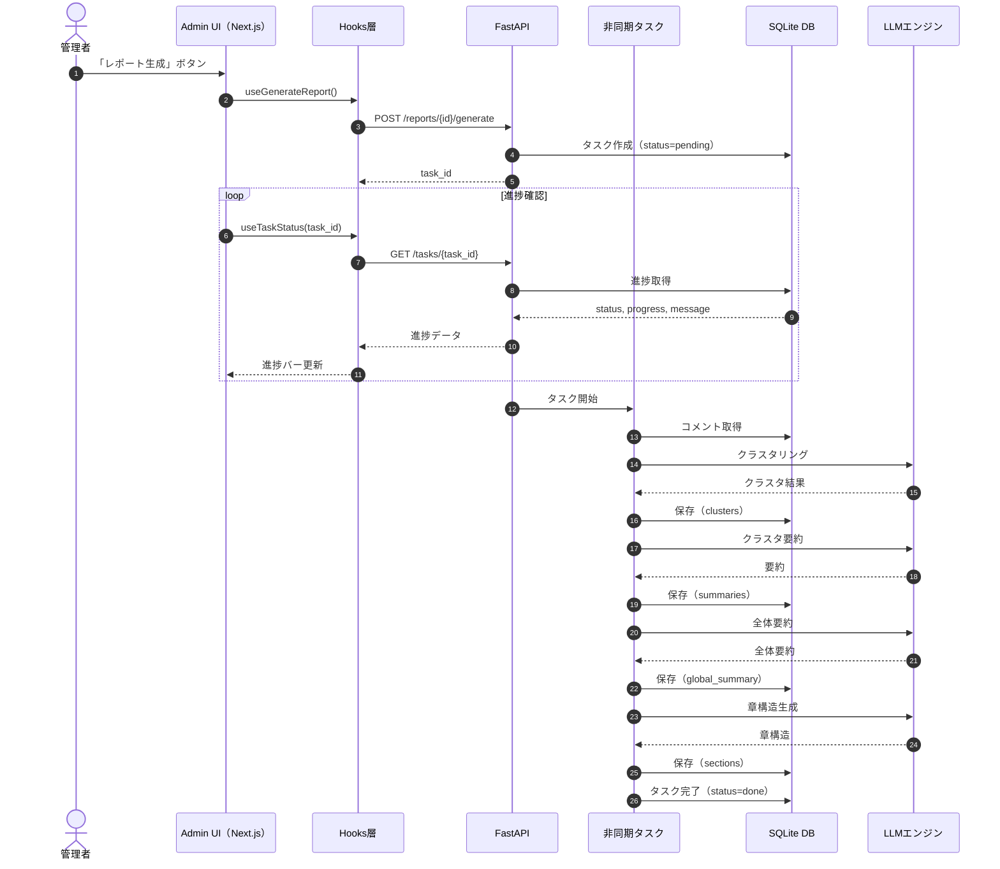

---




市民向けユースケース図（Mermaid）

```mermaid
%% 市民向けユースケース図（広聴AI public-viewer）
usecaseDiagram

actor 市民 as Citizen

rectangle "広聴AI 公開レポート（public-viewer）" {
  usecase "レポートのトップページを見る" as UC1
  usecase "全体要約を読む" as UC2
  usecase "テーマ（クラスタ）を選ぶ" as UC3
  usecase "テーマの要約を読む" as UC4
  usecase "市民のコメントを読む" as UC5
  usecase "グラフで全体像を把握する" as UC6
  usecase "章（セクション）を読む" as UC7
  usecase "レポート全体の総括を読む" as UC8
}

Citizen --> UC1
Citizen --> UC2
Citizen --> UC3
Citizen --> UC4
Citizen --> UC5
Citizen --> UC6
Citizen --> UC7
Citizen --> UC8

```


---

図の読み方（市民向けの行動フロー）

• UC1：公開されたレポートページにアクセス
• UC2：AI がまとめた全体要約を読む
• UC3：興味のあるテーマ（クラスタ）を選ぶ
• UC4：テーマの要約を読む
• UC5：実際の市民コメントを読む
• UC6：散布図や棒グラフで全体像を理解
• UC7：章（セクション）ごとに深掘り
• UC8：レポート全体の総括を読む


市民はこの流れで、
「全体 → テーマ → コメント → グラフ → 章 → 総括」
という自然な理解プロセスを辿ります。

---

必要であれば、運営ボード向け（非技術者向け）のユースケース図も Mermaid で作成できます。
次はそちらも作りますか？